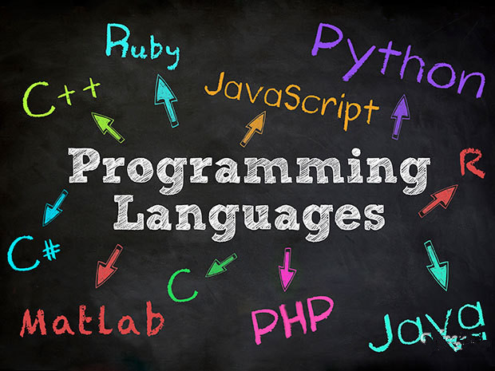

title: 综合练习--自动轮播
speaker: lizhiyuan
url:
theme:colors 
transition: rollIn
files:/css/style.css,/js/demo.js,/js/highlight/styles/monnokai_sublime.css

[slide]
# 综合练习--自动轮播
## 演讲者：李志远

[slide] {:.flexbox.vleft}
##综合练习--自动轮播
###HTML部分

````html

<!DOCTYPE html>
<html>
<head lang="en">
    <meta charset="UTF-8">
    <title></title>
</head>
<body>
<div id="box">
    <ul class="list">
        <li class="current"></li>
        <li></li>
        <li></li>
        <li></li>
        <li></li>
    </ul>
    <ul class="count">
        <li class="current">1</li>
        <li>2</li>
        <li>3</li>
        <li>4</li>
        <li>5</li>
    </ul>
</div>
</body>
</html>
````

[slide] {:.flexbox.vleft}
##综合练习--自动轮播
###CSS部分

```css
body,div,ul,li {
            margin:0;
            padding:0;
            border:0;
        }
        ul {
            list-style:none;
        }
        body {
            background:#000;
            text-align:center;
        }
        #box {
            position:relative;
            width:492px;
            height:170px;
            background:#fff;
            border-radius:5px;
            border:8px solid #fff;
            margin:10px auto;
        }
        #box .list li {
            position:absolute;
            top:0;
            left:0;
            width:490px;
            height:170px;
            opacity:0;
            filter:alpha(opacity=0);
        }
        #box .list li.current {
            opacity:1;filter:alpha(opacity=100);
        }
        #box .count {
            position:absolute;
            right:0;
            bottom:5px;
        }
        #box .count li {
            float:left;
            width:20px;
            height:20px;
            background:#f90;
            opacity:0.7;
            filter:alpha(opacity=70);
            border-radius: 20px;
            margin-left:5px;
            color:#fff;
            font-weight:800;
        }
        #box .count li.current {
            color:#fff;
            background:#f60;
            opacity:1;
            filter:alpha(opacity=100);
        }
```

[slide] {:.flexbox.vleft}
##综合练习--自动轮播
###javascript部分

```javascript
window.onload = function(){
        //第一步，选取要操作的元素
        var box = document.querySelectorAll('#box')[0];
        var oUl = document.querySelectorAll('.list')[0];
        var aLi = document.querySelectorAll('.list li');
        var aImg = document.querySelectorAll('img');
        var aNum = document.querySelectorAll('.count li');
        var index = 0;
        var timer = dd = null;
        var opa = 0;


        //先写手动的
        for(var i=0;i<aNum.length;i++){
            //先把下标存储一下
            aNum[i].index = i;
            aNum[i].onmouseover = function(){
                show(this.index);
            }
        }
        function show(a){
            //当前图片显示的时候，那么，其余的图片应该都是隐藏状态吧
            //这里，要改变下index的当前值就好了
            index = a;
            for(var i=0;i<aLi.length;i++){
                aLi[i].style.opacity = 0;
                aNum[i].className = '';

            }
            //让当前的图片显示
            aNum[a].className = 'current';
            aLi[a].style.opacity = 1;
            /*dd = setInterval(function(){
             opa  = opa + 2;
             aLi[index].style.opacity = opa / 100;
             if(opa == 100){
             opa = 0;
             clearInterval(dd);
             }
             },10);*/
        }


        //再写自动的
        function autoplay(){
            /*clearInterval(dd);*/
            timer = setInterval(function(){
                index++;
                if(index >= aLi.length){
                    index = 0;
                }
                console.log(index);
                show(index);
            },1000)
        }
        autoplay();

        //当鼠标移入这个box的时候，这个autoplay停止,移出的时候继续

        box.onmouseover = function(){
            clearInterval(timer);

        }
        box.onmouseout = function(){
            autoplay();
        }
    }
```
[slide] {:.flexbox.vleft}
##综合练习--自动轮播
###效果
<iframe src='/demos/image.html'></iframe>

[slide]
# 智游集团
## nodeJS培训课程